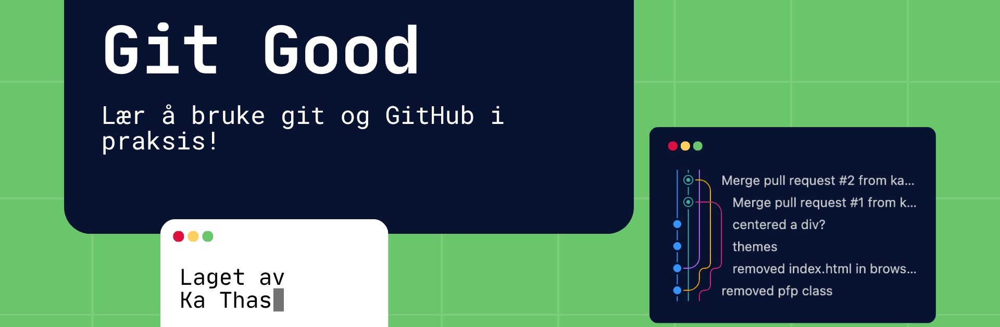

## Innhold 

- [Innhold](#innhold)
- [Beskrivelse](#beskrivelse)
- [Ekstra info](#ekstra-info)
  - [Prøv dette før du møter opp](#prøv-dette-før-du-møter-opp)


## Beskrivelse

Velkommen til Git Good!

Har du lyst til å få innføring i verdens mest brukte versjonskontrollsystem, og gjøre deg klar til arbeidslivet?

Bli med for å få hands-on erfaring i Git og plattformen GitHub.
 
Dette repoet er et supplement til arrangementet som holdes fysisk

[Her finner dere opplegget som ble/blir gjennomgått](https://github.com/ka-thas/git-good/blob/main/rookie-opplegg.md)

## Ekstra info

Kommandoene dere skal lære:

```bash
git add .
git commit -m "melding"
git push
git pull

git clone <URL>

git status
git log

git branch
git merge
```

### Prøv dette før du møter opp

Det er ikke farlig om du ikke får det til

Last ned git - dette kan du google deg frem til

> [!TIP]
>
> OBS! Windows-brukere
>
> Når du installerer git må du huske å velge alternativ 2 når du blir spurt følgende:
>
> **Adjust PATH Environment**
>
> - `Git Bash only` (Minimal, does not modify system PATH)
> - `Git from the command line and 3rd-party software` (Recommended, allows usage in PowerShell & CMD)
> - `Git and Unix tools from the command line` (Adds Unix tools, may cause conflicts)

For å sjekke om du allerede har git eller om nedlasting var vellykket kjør kommandoen
`git --version` i terminalen

```bash
$ git --version
> git version 2.39.5 (Apple Git-154)
```

Du kan nå teste git ved å lage en ny mappe og opprette et repo

```bash
$ mkdir test-git # lag en mappe
$ cd test-git # gå inn i mappen
$ git init # initialiser et git repo

$ echo tester git  >> README.md # opprett fil

$ git add . # Legg alle endringer i git
$ git commit -m "initial commit" # Lag din første commit
```

Hvis du har fått til alt dette så har du nå brukt git lokalt, og er på god vei til å bli en git mester!
