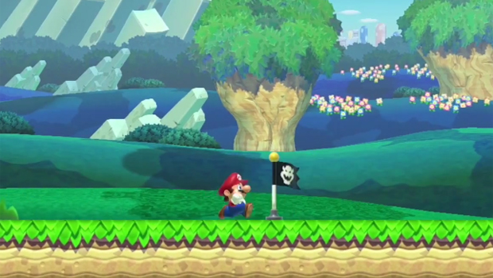
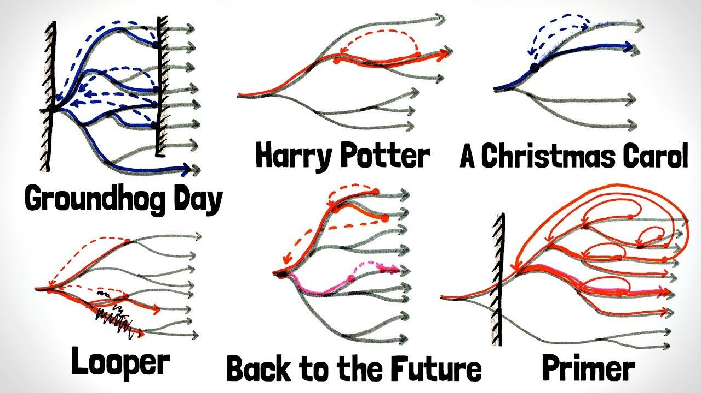

<!-- Flytt ut av secrets etter opplegget -->
# Velkommen til Git Good 🌱

- Ka Thas
- Robotikk 4. året
- Gruppelærer IN2010, IN2140, IN1080, IN1000
- Ansatt på Sonen for Eksperimentell Informatikk
- FUI styremedlem

## Menti.com

Still spørsmål underveis!11!!!!!
Rekk opp hånden, din feiging

## Hvorfor lære Git?

Relevant for

- IN2000 - Samarbeid
  - Dere trenger å bli kjent med de vanligste feilene før 2000
  - 20stp * 6 pers på gruppa = 120stp (Høye stakes)
  - Når man kommer til IN2000 tør man ikke å utforske git fordi man er redd for å gjøre noe feil og fakke opp hele prosjektet
- IN2140 - Samarbeid i Obligene og hjemme-eksamen
- IN1010 - Oblig 4 + lurt og være tidlig ute
- Egne prosjekter
  - Lurt for å starte egne prosjekter
  - Bidra i open-source prosjekter
- Arbeidslivet ←
  - Alle jobbintervjuer spør om du har kjennskap til git og tester forståelsen din av git som et verktøy

### Hva er git?

Et verktøy som løser et problem

- Har du noen gang vært i denne situasjonen?
  - `oblig3.docx`
  - `oblig3 finished.docx`
  - `oblig3 final.docx`
  - `oblig3 final v2.docx`
  - `oblig3 final v2 siste.docx`
  - `oblig3 final v2 FINAL.docx`
  - `oblig3 final v2 FINAL frfr.docx`
  - `oblig3 final v2 FINAL i_swear.docx`

Hver git *commit* har samme formål som flagget i Mario. Når du dør så kan du fortsette fra flagget, som er mye deiligere enn å starte fra starten av banen.

Git kan også minne om tidsreise. 

Fun facts

- Linus Torvalds
- "Global information tracker": you're in a good mood, and it actually works for you
- "Goddamn idiotic truckload of sh*t": when it breaks
- Linus lagde git på 5 dager, og på den 6. dagen hvilte han
  - note: Mye som måtte gjøres manuelt på den tida

### Hva er GitHub da?

- Kun en nettside/server som tar vare på filene dine
- Du kan ha *videoer* uten YouTube, right?
  - På samme måte kan man ha Git uten GitHub 
- Har brukere/profiler
- forks

## Hvordan *jeg* bruker Git

- Skal man bruke github.uio.no eller github.com?
  - mister tilgang på UiO-githuben når man går ut av UiO
  - github.com kan man bruke som porterfølje og for å hoste nettsider
  - Begge har ubegrenset antall repoer
- Struktur på repoene mine
- VSCode

## Hands-on practice

Learn by doing AKA. Fuck around and find out

Dette er tross alt en workshop, så jeg skal ikke stå her og yappe hele dagen

Hjelp naboen hvis de står fast

## Oppgave 1

[oppgaveteksten](./oppgaver.md/#level-1---baby-steps-)

## Litt om .git mappen og .gitignore

Veeeldig lite. Så vidt dyppe tærne.

## Oppgave 2

[oppgaveteksten](./oppgaver.md/#level-2---samarbeid-med-git-)

## Branching

- Hva er branching
- Hva brukes det til
- Hvordan bruker *jeg* det
- <https://github.com/ka-thas/in2140-oblig/network>

### Merge Conflicts

Dette dekker Stian på Intermediate kurset

Dere kommer til å møte på dette. Selv hvis dere jobber alene på flere branches

Hvordan unngår man det?

- Unngå å variabelnavn som brukes i flere deler av koden din. Vær spesielt forsiktig med "search and replace"
- Be til gitgudene
- Ha tunga rett i munnen når dette skjer

## Git-veien videre

- Lag et repo for hvert semester/emne/oblig
  - avhengig av hvor mye du vil øve
  - Husk å holde dem private
- Fork andres prosjekter #opensource
- Gjør ferdig [oppgavene](oppgaver.md)
- Lær dere selv:
  - håndtere merge conflicts
  - Blame
  - Diff

> [!TIP]
> Din friendly neighborhood LLM kan også lære deg git kommandoer

## Closing words

Håper dere har lært noe nytt, og blitt litt flittigere med git ~

